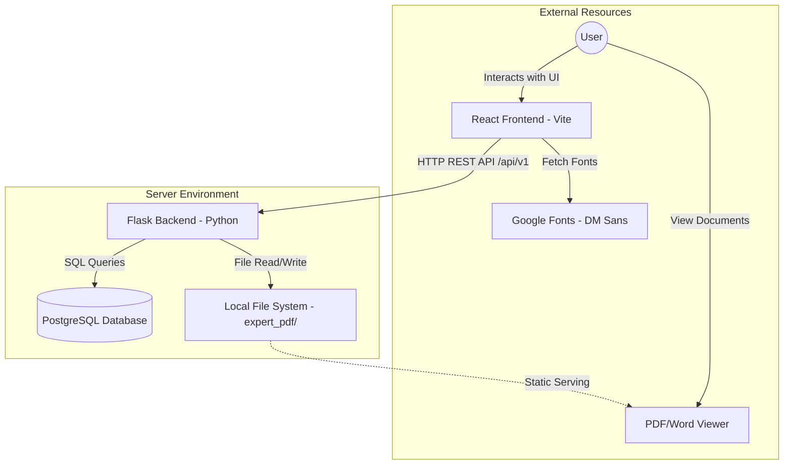
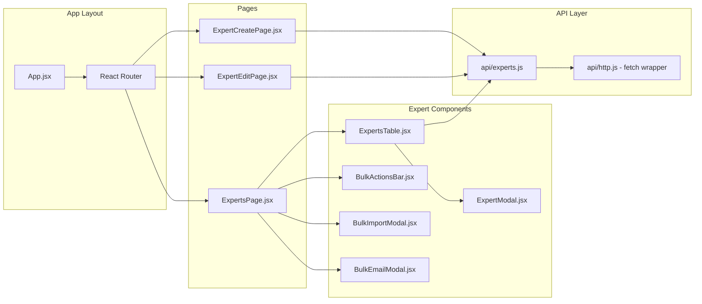
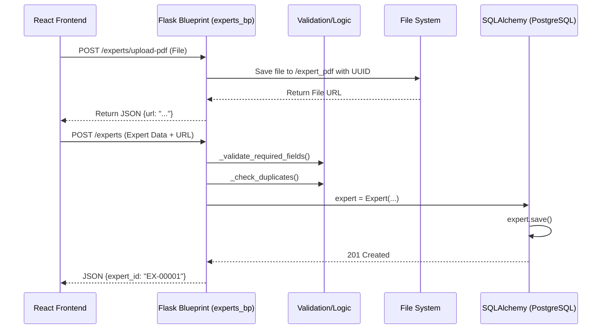

# System Architecture Documentation

This document outlines the high-level and low-level architecture of the **Hasamex Expert Database** application.

## 1. High-Level Architecture (Conceptual View)

The application follows a classic **Client-Server** architecture, with a decoupled Frontend and Backend communicating via a RESTful API.

### Core Technologies
- **Frontend**: React 18, Vite, Vanilla CSS.
- **Backend**: Python 3, Flask, SQLAlchemy ORM.
- **Database**: PostgreSQL (for structured expert data and lookups).
- **Storage**: Local File System (for physical document storage).

---

## 2. Low-Level Component Architecture

### A. Frontend Component Interaction
The frontend is organized into logical pages and reusable components focused on the "Expert" entity.

### B. Backend Request Lifecycle
How a request (e.g., "Create Expert with PDF") travels through the backend system.

---

## 3. Data Schema & Storage

### Expert Entity
Stored in the `experts` table.
- **Identity**: `id` (UUID), `expert_id` (Sequential formatted ID e.g., EX-00001).
- **Profile**: Name, Email, Phone, LinkedIn, Bio, Employment History.
- **Financial**: `hourly_rate`, `currency`, `payment_details`.
- **History**: `events_invited_to`, `total_calls_completed`.
- **Classification**: `expert_status`, `hcms_classification`, `region`, `primary_sector`.
- **Documents**: `profile_pdf_url` (Link to stored file).

### Lookup System
Used for populating dropdowns (Salutation, Region, Seniority, etc.) via the `lookup_tables` table.

---

## 4. Key Functional Flows

### Bulk Import Workflow
1. **Upload**: User uploads `.xlsx` or `.csv`.
2. **Analysis**: Flask uses **Pandas** to parse and compare with existing DB records.
3. **Normalization**: Data is cleaned (formatting emails, dates) for accurate comparison.
4. **Preview**: Frontend shows a "Diff" highlighting new vs. updated experts.
5. **Confirm**: On confirmation, backend performs batch `updates` or `inserts`.

### PDF Upload Workflow
- **Frontend**: Uses `FormData` to send the binary file.
- **Backend Storage**: Files are saved with unique names to `backend/expert_pdf/`.
- **Serving**: Flask `app.py` serves the directory via `/expert_pdf/<filename>` as a static route with appropriate MIME headers.
