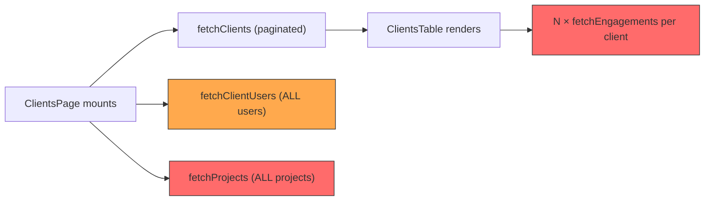

# Client Pages — API Call Optimization Plan

> **Goal**: Reduce the number of HTTP round-trips, eliminate N+1 query patterns, and speed up every Client-related page while keeping all other pages untouched.

---

## 1 — Current State: API Call Audit

### 1.1 ClientsPage.jsx (List page — the biggest offender)

| # | API Call | Trigger | Payload Size | Problem |
|---|---------|---------|--------------|---------|
| 1 | `GET /clients?page=&limit=20&search=` | Page load, search, page change | 20 client rows | ✅ OK — paginated |
| 2 | `GET /clients/users` | Every load | **ALL** users in the entire system | ⚠️ Over-fetch: returns every user just to map `primary_contact_user_id` → name |
| 3 | `GET /projects` | Every load (no filter) | **ALL** projects in the entire system | 🔴 Critical: fetches every project across all clients just to build a client → project‐count map |
| 4–23 | `GET /engagements?client_id=<N>` × **N** (inside [ClientsTable.jsx](file:///c:/Users/User/Desktop/demo/Expert-Searching-App/frontend/src/components/clients/ClientsTable.jsx)) | After clients render | 1 call per visible client row (up to 20) | 🔴 **N+1 pattern**: fires 20 parallel HTTP requests purely to count engagements per client |

**Total on first load: 3 + N (≈ 23 requests) with N = 20 client rows.**

> [!CAUTION]
> Every search keystroke or page change re-triggers all 3 + N calls because `page`, `search`, and `refreshKey` are all `useEffect` dependencies.

### 1.2 ClientDetails.jsx (Single client view)

| # | API Call | Trigger | Problem |
|---|---------|---------|---------|
| 1 | `GET /clients/<id>` | Page load | ✅ OK |
| 2 | `GET /users?limit=1000&client_id=<id>` (inside [ClientUsersBasicTable](file:///c:/Users/User/Desktop/demo/Expert-Searching-App/frontend/src/components/users/ClientUsersBasicTable.jsx#5-120)) | Render of child component | ⚠️ `limit=1000` hard-coded |
| 3 | `GET /engagements?limit=1000&client_id=<id>` (inside [EngagementAssignmentsTable](file:///c:/Users/User/Desktop/demo/Expert-Searching-App/frontend/src/components/engagements/EngagementAssignmentsTable.jsx#5-102)) | Render of child component | ⚠️ `limit=1000` hard-coded; fetches full engagement rows just to display a table |

**Total: 3 requests (acceptable, but child components each fetch independently).**

### 1.3 ClientEditPage.jsx

| # | API Call | Trigger | Problem |
|---|---------|---------|---------|
| 1 | `GET /clients/users` | Mount | Same as ClientsPage — fetches **ALL** users |
| 2 | `GET /lookups` | Mount | ✅ static data — OK |
| 3 | `GET /users?page=1&limit=1000` | Mount | 🔴 Fetches up to 1000 users just to populate a dropdown filtered by client name |
| 4 | `GET /clients/<id>` | Mount | ✅ OK |

**Total: 4 requests.** Calls #1 and #3 are redundant/excessive.

### 1.4 ClientCreatePage.jsx

| # | API Call | Trigger | Problem |
|---|---------|---------|---------|
| 1 | `GET /clients/users` | Mount | Same over-fetch |
| 2 | `GET /users?page=1&limit=1000` | Mount | 🔴 Fetches 1000 users |
| 3 | `GET /lookups` | Mount | ✅ OK |

**Total: 3 requests.** Same issues as Edit page.

---

## 2 — Root Cause Analysis



| Issue | Severity | Root Cause |
|-------|----------|------------|
| **N+1 Engagement Count** | 🔴 Critical | [ClientsTable.jsx](file:///c:/Users/User/Desktop/demo/Expert-Searching-App/frontend/src/components/clients/ClientsTable.jsx) fires `GET /engagements?client_id=<id>` for each row just to get a count |
| **All-Projects Fetch** | 🔴 Critical | [fetchProjects()](file:///c:/Users/User/Desktop/demo/Expert-Searching-App/frontend/src/api/clients.js#65-77) has no client_id filter on the list page — downloads every project |
| **All-Users Fetch** | ⚠️ High | [fetchClientUsers()](file:///c:/Users/User/Desktop/demo/Expert-Searching-App/frontend/src/api/clients.js#55-64) returns entire [users](file:///c:/Users/User/Desktop/demo/Expert-Searching-App/backend/routes/clients.py#238-242) table for a name lookup |
| **Duplicate User Fetch** | ⚠️ High | Edit/Create pages call BOTH [fetchClientUsers()](file:///c:/Users/User/Desktop/demo/Expert-Searching-App/frontend/src/api/clients.js#55-64) AND [fetchUsers(limit:1000)](file:///c:/Users/User/Desktop/demo/Expert-Searching-App/frontend/src/api/users.js#3-30) |
| **No Backend Aggregation** | 🔴 Critical | Backend `GET /clients` returns flat rows with no counts — forcing frontend to fetch them separately |
| **Re-fetch on Every Interaction** | ⚠️ Medium | Users/Projects/Engagements re-fetched on every search/page change instead of being cached |

---

## 3 — Proposed Changes

### Phase 1: New Backend Endpoint — `GET /clients/summary` (server-side aggregation)

#### [MODIFY] [clients.py](file:///c:/Users/User/Desktop/demo/Expert-Searching-App/backend/routes/clients.py)

Add a new endpoint that returns the clients list with pre-computed counts:

```python
@clients_bp.route('/summary', methods=['GET'])
def get_clients_summary():
    """
    GET /api/v1/clients/summary?page=1&limit=20&search=...
    Returns clients with project_count, engagement_count, user_count
    pre-computed server-side. Replaces 3+N frontend calls with 1.
    """
```

**SQL approach** — use subqueries for counts:

```sql
SELECT c.*,
       (SELECT COUNT(*) FROM projects p WHERE p.client_id = c.client_id)      AS project_count,
       (SELECT COUNT(*) FROM engagements e WHERE e.client_id = c.client_id)   AS engagement_count,
       (SELECT COUNT(*) FROM users u WHERE u.client_id = c.client_id)         AS user_count
FROM   clients c
WHERE  ...
ORDER BY c.updated_at DESC NULLS LAST
LIMIT 20 OFFSET 0;
```

The response shape will be identical to the current `GET /clients` but each row will include three extra fields:

```json
{
  "project_count": 3,
  "engagement_count": 12,
  "user_count": 5
}
```

---

### Phase 2: New Backend Endpoint — `GET /clients/form-lookups`

#### [MODIFY] [clients.py](file:///c:/Users/User/Desktop/demo/Expert-Searching-App/backend/routes/clients.py)

A single endpoint for Edit/Create form dependencies:

```python
@clients_bp.route('/form-lookups', methods=['GET'])
def get_client_form_lookups():
    """
    Returns:
      - client_users: [{user_id, user_name, client_id, client_name}]
      - hasamex_users: [{id, name}]
    Replaces 3 separate calls (fetchClientUsers + fetchUsers(1000) + /lookups)
    """
```

---

### Phase 3: Frontend — ClientsPage.jsx Optimization

#### [MODIFY] [ClientsPage.jsx](file:///c:/Users/User/Desktop/demo/Expert-Searching-App/frontend/src/pages/clients/ClientsPage.jsx)

- Replace the 3-call `Promise.all` with a **single** `GET /clients/summary` call
- Remove [fetchClientUsers()](file:///c:/Users/User/Desktop/demo/Expert-Searching-App/frontend/src/api/clients.js#55-64) and [fetchProjects()](file:///c:/Users/User/Desktop/demo/Expert-Searching-App/frontend/src/api/clients.js#65-77) imports
- Remove [users](file:///c:/Users/User/Desktop/demo/Expert-Searching-App/backend/routes/clients.py#238-242), `projects`, `usersById`, `projectsByClientId`, `usersByClientId` state and memos
- Pass counts directly from the summary response to [ClientsTable](file:///c:/Users/User/Desktop/demo/Expert-Searching-App/frontend/src/components/clients/ClientsTable.jsx#16-293) and [ClientsCardGrid](file:///c:/Users/User/Desktop/demo/Expert-Searching-App/frontend/src/components/clients/ClientsCardGrid.jsx#3-33)

**Before (3 + N calls):**
```js
Promise.all([
    fetchClients({ page, limit: LIMIT, search }),
    fetchClientUsers(),     // ← ALL users
    fetchProjects(),        // ← ALL projects
])
```

**After (1 call):**
```js
const result = await fetchClientsSummary({ page, limit: LIMIT, search });
// result.data already contains project_count, engagement_count, user_count per row
```

---

### Phase 4: Frontend — ClientsTable.jsx Optimization

#### [MODIFY] [ClientsTable.jsx](file:///c:/Users/User/Desktop/demo/Expert-Searching-App/frontend/src/components/clients/ClientsTable.jsx)

- **Remove** the entire `useEffect` that fires N engagement API calls (lines 39-67)
- **Remove** `engagementCounts` state
- **Remove** the `http` import
- Accept `engagementCount` and `projectCount` directly from props (already present in the summary data)
- Simplify `rows` memo to use counts from client data directly

**Before:** 20 additional HTTP requests per render.
**After:** 0 additional HTTP requests.

---

### Phase 5: Frontend — ClientsCardGrid / ClientCard Optimization

#### [MODIFY] [ClientsCardGrid.jsx](file:///c:/Users/User/Desktop/demo/Expert-Searching-App/frontend/src/components/clients/ClientsCardGrid.jsx)

- Remove `projectsByClientId` and `usersByClientId` props
- Pass pre-computed counts from summary data instead

#### [MODIFY] [ClientCard.jsx](file:///c:/Users/User/Desktop/demo/Expert-Searching-App/frontend/src/components/clients/ClientCard.jsx)

- Accept `projectCount` and `userCount` as props directly (numbers instead of arrays)
- Remove `projects.length` and `users.length` computations

---

### Phase 6: Frontend — ClientEditPage / ClientCreatePage Optimization

#### [MODIFY] [ClientEditPage.jsx](file:///c:/Users/User/Desktop/demo/Expert-Searching-App/frontend/src/pages/clients/ClientEditPage.jsx)

- Replace 3 separate calls ([fetchClientUsers()](file:///c:/Users/User/Desktop/demo/Expert-Searching-App/frontend/src/api/clients.js#55-64), `/lookups`, [fetchUsers(1000)](file:///c:/Users/User/Desktop/demo/Expert-Searching-App/frontend/src/api/users.js#3-30)) with **1 call** to `GET /clients/form-lookups`
- On Edit: parallel call [fetchClientById(id)](file:///c:/Users/User/Desktop/demo/Expert-Searching-App/frontend/src/api/clients.js#21-25) alongside `fetchClientFormLookups()`

**Before (4 calls):**
```js
fetchClientUsers().then(setUsers);
http('/lookups').then(...);
fetchUsers({ page: 1, limit: 1000 }).then(...);
fetchClientById(id).then(...);
```

**After (2 calls):**
```js
Promise.all([
    fetchClientById(id),
    fetchClientFormLookups(),
])
```

#### [MODIFY] [ClientCreatePage.jsx](file:///c:/Users/User/Desktop/demo/Expert-Searching-App/frontend/src/pages/clients/ClientCreatePage.jsx)

- Replace 3 separate calls with **1 call** to `GET /clients/form-lookups`

**Before (3 calls) → After (1 call).**

---

### Phase 7: Frontend API Layer

#### [MODIFY] [clients.js](file:///c:/Users/User/Desktop/demo/Expert-Searching-App/frontend/src/api/clients.js)

Add two new API functions:

```js
export async function fetchClientsSummary({ page = 1, limit = 20, search = '' } = {}) {
    const query = new URLSearchParams({ page: String(page), limit: String(limit), search });
    const result = await http(`/clients/summary?${query.toString()}`);
    return { data: result.data || [], meta: result.meta || { ... } };
}

export async function fetchClientFormLookups() {
    const result = await http('/clients/form-lookups');
    return result.data || {};
}
```

Remove [fetchClientUsers](file:///c:/Users/User/Desktop/demo/Expert-Searching-App/frontend/src/api/clients.js#55-64) and [fetchProjects](file:///c:/Users/User/Desktop/demo/Expert-Searching-App/frontend/src/api/clients.js#65-77) if no longer used elsewhere (verify first).

---

## 4 — Impact Summary

| Page | Before | After | Improvement |
|------|--------|-------|-------------|
| **ClientsPage** | 3 + N calls (≈23) | **1 call** | **~95% reduction** |
| **ClientEditPage** | 4 calls | **2 calls** | **50% reduction** |
| **ClientCreatePage** | 3 calls | **1 call** | **67% reduction** |
| **ClientDetails** | 3 calls | 3 calls (no change) | Unchanged — already efficient |

> [!IMPORTANT]
> All changes are **additive** — new endpoints are added alongside existing ones. Existing endpoints remain untouched, so no other pages are affected.

---

## 5 — Files Affected

| File | Change Type | Risk |
|------|-------------|------|
| [backend/routes/clients.py](file:///c:/Users/User/Desktop/demo/Expert-Searching-App/backend/routes/clients.py) | Add 2 new endpoints | Low — new routes only |
| [frontend/src/api/clients.js](file:///c:/Users/User/Desktop/demo/Expert-Searching-App/frontend/src/api/clients.js) | Add 2 new functions, deprecate 2 | Low |
| [frontend/src/pages/clients/ClientsPage.jsx](file:///c:/Users/User/Desktop/demo/Expert-Searching-App/frontend/src/pages/clients/ClientsPage.jsx) | Simplify data fetching | Medium — main list page |
| [frontend/src/components/clients/ClientsTable.jsx](file:///c:/Users/User/Desktop/demo/Expert-Searching-App/frontend/src/components/clients/ClientsTable.jsx) | Remove N+1 engagement calls | Medium — core table |
| [frontend/src/components/clients/ClientsCardGrid.jsx](file:///c:/Users/User/Desktop/demo/Expert-Searching-App/frontend/src/components/clients/ClientsCardGrid.jsx) | Simplify props | Low |
| [frontend/src/components/clients/ClientCard.jsx](file:///c:/Users/User/Desktop/demo/Expert-Searching-App/frontend/src/components/clients/ClientCard.jsx) | Simplify props | Low |
| [frontend/src/pages/clients/ClientEditPage.jsx](file:///c:/Users/User/Desktop/demo/Expert-Searching-App/frontend/src/pages/clients/ClientEditPage.jsx) | Consolidate lookups | Low |
| [frontend/src/pages/clients/ClientCreatePage.jsx](file:///c:/Users/User/Desktop/demo/Expert-Searching-App/frontend/src/pages/clients/ClientCreatePage.jsx) | Consolidate lookups | Low |

**Pages NOT affected:** All Expert pages, Engagement pages, Project pages, User pages, Lead pages, Dashboard.

---

## 6 — Verification Plan

### Automated

No existing frontend or backend test suite was found (only [smoke_test.py](file:///c:/Users/User/Desktop/demo/Expert-Searching-App/backend/smoke_test.py) and [test_db.py](file:///c:/Users/User/Desktop/demo/Expert-Searching-App/backend/test_db.py) exist, which are basic connectivity checks). We will add:

1. **Backend smoke test** — a new `test_clients_api.py` script that calls:
   - `GET /api/v1/clients/summary?page=1&limit=5` and verifies `project_count`, `engagement_count`, `user_count` exist in each row
   - `GET /api/v1/clients/form-lookups` and verifies `client_users` and `hasamex_users` keys exist
   - Both endpoints return 200 status codes

### Manual (recommended for user)

1. **ClientsPage load time** — Open browser DevTools → Network tab. Navigate to the Clients page. Verify:
   - Only **1** API call (`/clients/summary`) fires instead of 3 + N
   - Engagement count column displays the correct number for each row
   - Project count badge is correct
   - Search, pagination, bulk delete, view toggle all still work
2. **ClientEditPage** — Click Edit on any client. Verify:
   - Form loads with correct pre-filled values
   - Dropdowns for Primary Contact, Client Solution, Sales Team all populate correctly
   - Saving changes works (navigate back shows updated data)
3. **ClientCreatePage** — Click "+ Create Client". Verify:
   - All dropdowns populate correctly
   - Creating a new client succeeds
4. **ClientDetails** — Click on any client name. Verify:
   - All details render correctly (no change expected here)
5. **Other pages** — Spot-check that Expert list, Engagement list, Project list, and User list pages still work with no regressions
