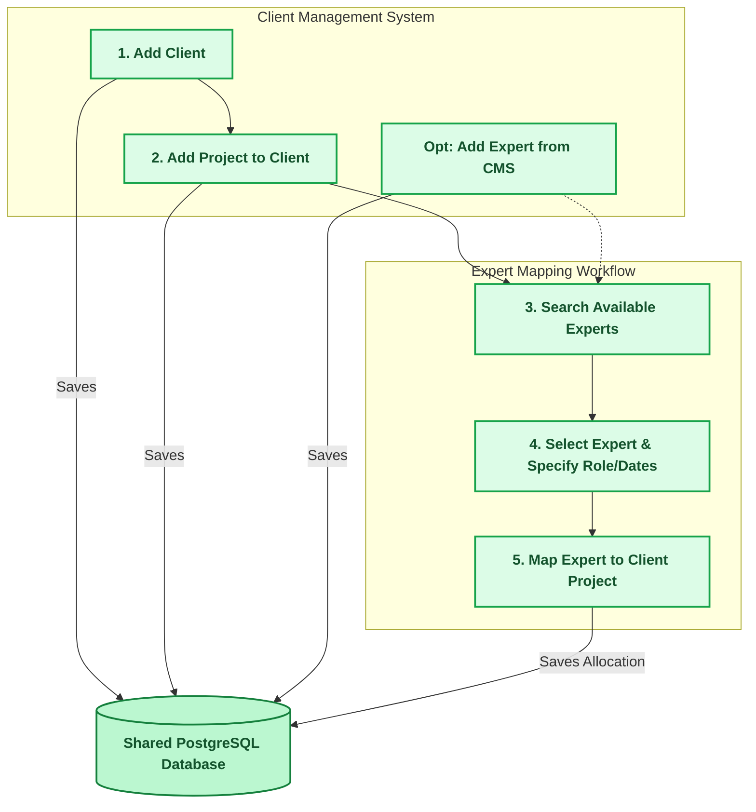

# Development Plan: Expert and Client Management Systems

## 1. Overview
This plan outlines the architecture, database design, and a 4-week timeline for developing two integrated but distinct web applications:
- **Expert Management System**: An application to manage an expert pool, their profiles, domains, skills, and overall availability.
- **Client Management System**: An application to manage clients, their projects, and the allocation of specific experts to those projects.

Both applications will share the same backend API and database. This ensures data consistency and enables real-time updates regarding expert availability and project assignments.

The allocation logic will heavily inherit structural patterns from the previous Employee Management System (EMS), specifically adapting insights from `CustomerProjectsTab.jsx`, `ProjectsTab.jsx`, and `project_routes.py`.

---

## 2. Architecture Details
- **Frontend Applications**: Two separate Single-Page Applications (React + Vite) for role-based separation of concerns, utilizing global vannila CSS for modern, dynamic UI designs.
- **Shared Backend**: A singleREST API (Python/Flask) that handles all interactions, authentication, and cross-application data synchronization.
- **Database**: A shared relational database (PostgreSQL) storing all entities.

### 2.1 Mapping Workflow Diagram
The following diagram illustrates the workflow for adding clients, projects, and experts, and then mapping experts to client projects:

---

## 3. Database Schema Mapping
To support a many-to-many relationship between Experts and Projects while associating Projects strictly to Clients, we will adapt the EMS structures:

- **Clients** *(Equivalent to EMS Customers)*: `id`, `client name`, `location`, `domain`, `status`, `created_at`.
- **Projects**: `id`, `name`, `client_id` (Foreign Key), `description`, `status` (Planning, Active, Completed, On Hold), `start_date`, `end_date`.
- **Experts** *(Equivalent to EMS Employees)*: `id`, `first_name`, `last_name`, `expertise_domain`, `status`, `availability`.
- **ProjectExpertAllocation** *(Equivalent to EMS ProjectAllocation)*: `id`, `project_id` (Foreign Key), `expert_id` (Foreign Key), `role`, `allocation_percentage`, `start_date`, `end_date`, `status` (Active, Inactive).

---

## 4. Work Breakdown & 1-Month Timeline

### Week 1: Foundation and Shared Backend Architecture
**Goal**: Design the shared database schemas and build core API endpoints.
- **Day 1-2**: Database schema modelling for `Clients`, `Projects`, `Experts`, and `ProjectExpertAllocation`. Execute database migrations.
- **Day 3-4**: Develop backend API routes for Client Management operations (`/api/clients`, `/api/clients/:id/projects`). Implement necessary eager-loading optimizations inherited from the previous project to avoid N+1 queries.
- **Day 5**: Develop backend API routes for Project mapping (`/api/projects/:id/experts`). Ensure the team fetching API logic handles errors, caching, and empty states smoothly exactly like the reference `project_routes.py`.

### Week 2: Client Management System (Frontend Base)
**Goal**: Implement the CMS application focused on clients and their project.
- **Day 6-7**: Scaffold the Client Management frontend app. Set up the UI layout, routing framework. User can create a expert in client management system also.
- **Day 8-9**: Develop Client/Customer views (adapting `CustomerProjectsTab.jsx`). Include the creation modal, SearchableDropdown component, and status constraint validation (e.g., verifying child projects before completion).
- **Day 10**: Develop Project views (adapting `ProjectsTab.jsx`). Handle lists of projects tied to specific clients, project modals, and infinite scroll pagination structures.

### Week 3: Expert Mapping and Integration
**Goal**: Implement the allocation logic linking Experts to Client Projects.
- **Day 11-12**: Create the **"Expert Allocation Modal"** inside the Client Management System. Allow searching for available Experts based on active status/skills and mapping them to the active Project.
- **Day 13**: Build out the aggregate team visualization for Projects. Adapt logic like `calculateProjectAvgUtilization()` and `getCurrentWeekTeamMembers()` to properly deduplicate logic and show real-time expert utilization.
- **Day 14-15**: Refine the **Expert Management System**. Add a dedicated "Allocations Tab" to an expert's profile to display their mapped client projects (read-only from the EMS side).

### Week 4: Polish, QA, and Delivery
**Goal**: Ensure high-quality UI/UX, bug-free allocation logic, and robust performance.
- **Day 16-17**: Refine shared UI components. Include smooth fade-in animations, customized scrollbars, unified typography, and loading skeletons.
- **Day 18-19**: Testing & Quality Assurance. Ensure validation workflows behave properly (e.g., date conflicts in allocations, duplicate internal projects check). Verify caching mechanics in the project tabs.
- **Day 20**: Final staging deployment of the shared backend and both frontends. Prepare handover documentation, covering the newly developed APIs and application workflows.
